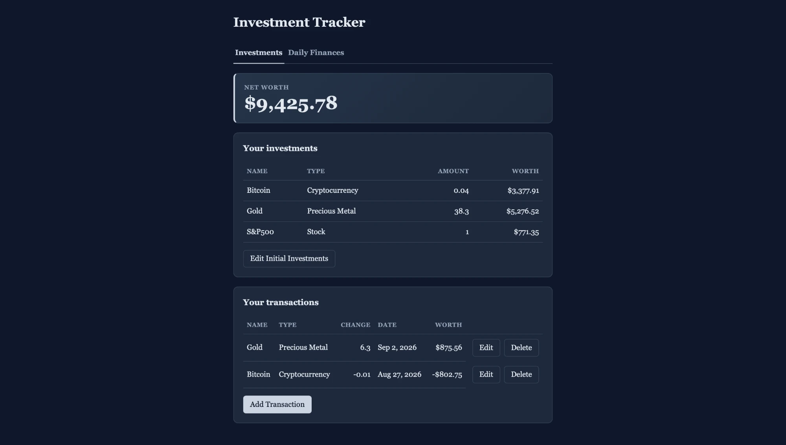
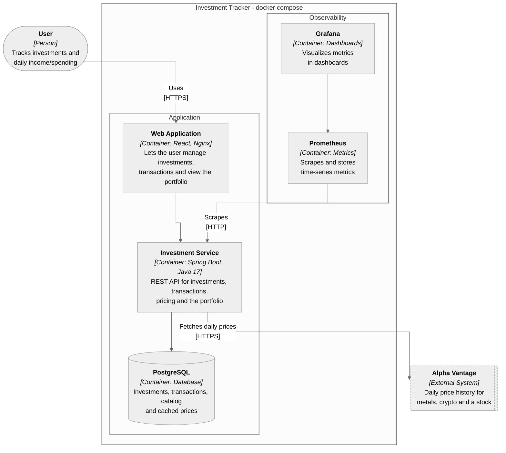
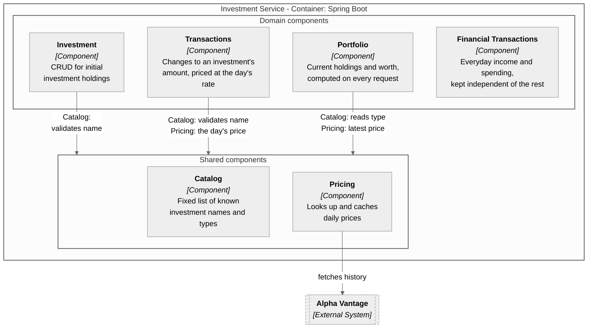

# Investment Tracker

[](https://github.com/ahmet-cskn/investment-tracker/actions/workflows/ci.yml)

- This is an investment tracking and personal finance application.
- You record your initial holdings and each buy or sell. The app calculates the USD value of every transaction and your current net worth automatically, using real daily prices from a public financial data API (Alpha Vantage).
- Prices are cached, so the app doesn't need to look up the same price twice and stays within the API's free daily quota, even when the app is reloaded multiple times.
- You can also track and organize your everyday income and spending, which is kept separate from your investments so it never affects your portfolio or net worth.



## Tech Stack

- **Backend:** Java 17, Spring Boot 4.1, Maven
- **Frontend:** React 19 in plain JavaScript, built with Vite
- **Database:** PostgreSQL, with schema migrations managed by Liquibase
- **Infrastructure:** Docker and Docker Compose, Nginx (serving the frontend), GitHub Actions for CI
- **Observability:** Micrometer, Prometheus and Grafana
- **API documentation:** OpenAPI/Swagger UI, via springdoc-openapi
- **External data:** Alpha Vantage API, for daily price history

## Architecture

Diagrams follow the C4 model: a container diagram for the whole system, and a component
diagram for what's inside the backend. The backend is a single deployable service (a modular monolith), not several
microservices; its internal packages are drawn as components to show the boundaries between them without the
operational cost of splitting them into separate services, which nothing here currently needs.

### Container diagram

- The user opens the web application in a browser and uses it over HTTPS.
- The frontend (React, served by Nginx) calls the backend's REST API in JSON over HTTPS.
- The backend reads and writes PostgreSQL over JDBC: investments, transactions, the catalog, and cached prices.
- The backend calls Alpha Vantage over HTTPS to fetch daily price history whenever its cache needs refreshing.
- Prometheus scrapes the backend's `/actuator/prometheus` endpoint over HTTP on a schedule to collect metrics.
- Grafana queries Prometheus (PromQL) to render its dashboards.



### Component diagram - Investment Service

- Investment asks Catalog to validate a name before it creates or updates an initial holding.
- Transactions asks Catalog to validate a name, and asks Pricing for that day's price to calculate the transaction's worth.
- Portfolio asks Catalog for each investment's type, and Pricing for its latest price, to value the current holdings.
- Pricing fetches daily price history from Alpha Vantage whenever its cache needs refreshing, and caches the result.
- Financial Transactions calls neither Catalog nor Pricing: it has no dependency on the investment side at all.



## Setup and Running

### Prerequisites

- **Docker** (Docker Compose is bundled with Docker Desktop): This is the only requirement for running the app as-is.
- **A free [Alpha Vantage](https://www.alphavantage.co/support/#api-key) API key**: This is optional. Without one the app
  runs normally, but no investment ever gets a worth, since there are no prices to compute it from.

### 1. Get the code

```bash
git clone https://github.com/ahmet-cskn/investment-tracker.git
cd investment-tracker
```

### 2. Add an API key (optional)

```bash
cp .env.example .env
```

Open `.env` and set `ALPHAVANTAGE_API_KEY` to your key. This file is git-ignored, so the key is never committed. If
you skip this step, the app still starts and works, investments simply show no worth.

### 3. Run it

The whole application (the database, the backend, the frontend, and the monitoring stack) starts with one command:

```bash
docker compose up --build
```

Once it's running:

| | |
|---|---|
| Web app | http://localhost:3000 |
| API | http://localhost:8080/api/investments |
| API docs (Swagger UI) | http://localhost:8080/swagger-ui.html |
| Grafana | http://localhost:3001 |
| Prometheus | http://localhost:9090 |

Stop everything with `docker compose down`. Data is kept in a Docker volume between runs; add `-v` to that command to
wipe it.

## Continuous integration

[`.github/workflows/ci.yml`](.github/workflows/ci.yml) runs on every pull request and every push to `main`, with three parallel jobs:

- **Backend:** `mvn verify` (unit tests and Testcontainers integration tests)
- **Frontend:** lint, tests and production build
- **Docker:** builds the backend and frontend images, starts the whole stack with Compose (Postgres, both of those, Prometheus and Grafana), and smoke-tests it through nginx
