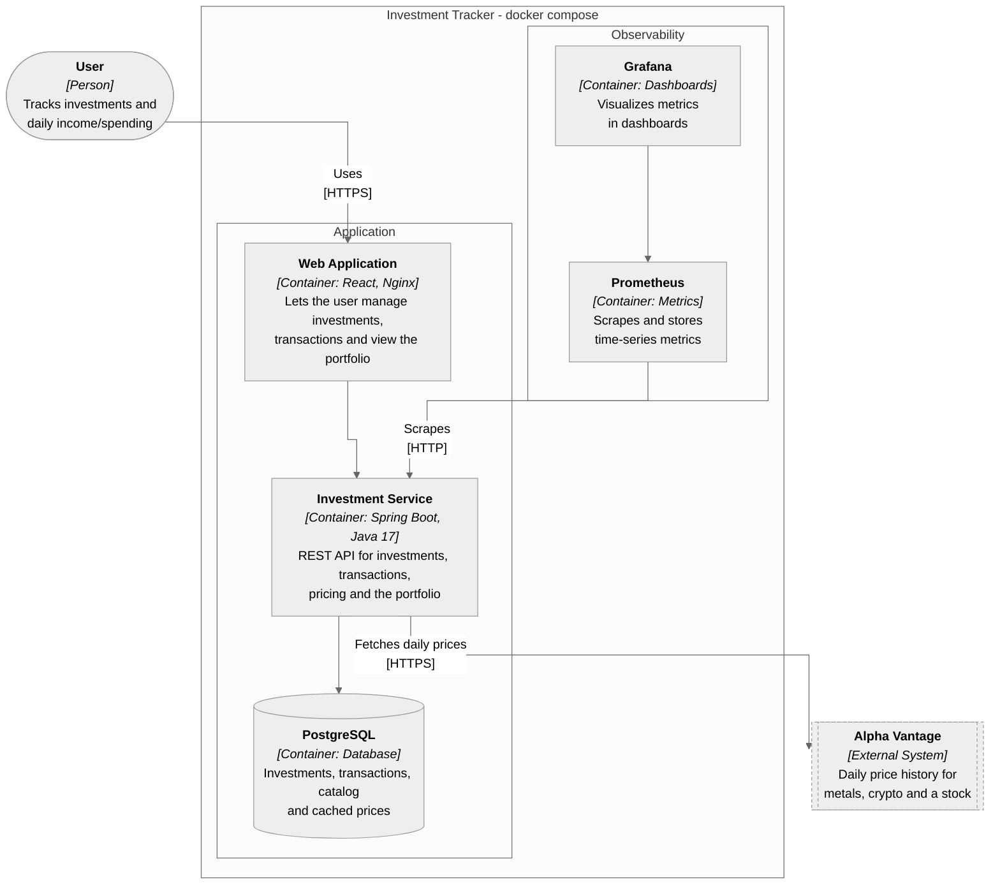
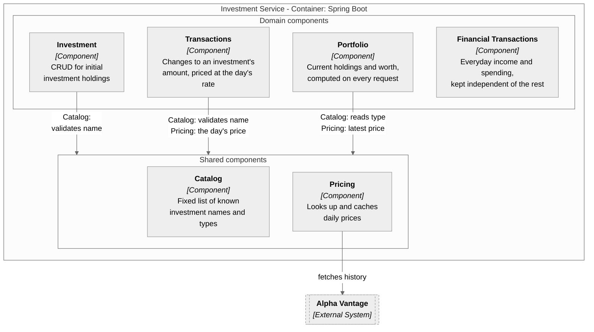

# Investment Tracker

[](https://github.com/ahmet-cskn/investment-tracker/actions/workflows/ci.yml)

A personal finance and investment tracker, built as a set of Spring Boot microservices with a React frontend.

## Architecture

Diagrams follow the [C4 model](https://c4model.com): a container diagram for the whole system, and a component
diagram for what's inside the backend. The backend is a single deployable service (a modular monolith), not several
microservices; its internal packages are drawn as components to show the boundaries between them without the
operational cost of splitting them into separate services, which nothing here currently needs.

### Container diagram



### Component diagram - Investment Service



Each arrow into "Shared components" is one component's dependency on Catalog and/or Pricing, named in its label; it
points at the group rather than at Catalog or Pricing individually so two components each depending on both doesn't
draw as a confusing crisscross. Financial Transactions has no arrow at all: it's deliberately independent, so it can
never leak into the portfolio or the investment transactions (see
[`financialtransaction`](services/investment-service/src/main/java/com/investmenttracker/investmentservice/financialtransaction)).
Every component also reads and writes its own tables in the shared PostgreSQL database; those edges are left out here
to keep this diagram legible (the container diagram above already covers the database).

## Components

| Component | Description |
|---|---|
| [`services/investment-service`](services/investment-service) | CRUD for investments (name + amount), backed by PostgreSQL |
| [`frontend`](frontend) | React single-page UI for managing investments |

## Quick start

The only requirement is Docker. This builds and starts PostgreSQL, the backend and the frontend:

```bash
docker compose up --build
```

- UI: http://localhost:3000
- API: http://localhost:8080/api/investments
- Swagger UI: http://localhost:8080/swagger-ui.html
- Grafana: http://localhost:3001 (no login needed)
- Prometheus: http://localhost:9090

Stop everything with `docker compose down`. The data lives in a Docker volume and survives restarts; add `-v` to delete it.

## Development

For hot reload while coding, run only the database in Docker and the apps on your machine. Stop the containerised backend and frontend first (`docker compose down`), as they use the same ports.

Prerequisites: JDK 17+, Maven 3.9+, Node.js 20+ and npm, and Docker (for Postgres and the backend integration tests).

Start PostgreSQL:

```bash
docker compose up -d postgres
```

Run the backend:

```bash
cd services/investment-service && mvn spring-boot:run
```

- API: http://localhost:8080/api/investments
- Swagger UI: http://localhost:8080/swagger-ui.html

Database connection settings can be overridden with `DB_URL`, `DB_USERNAME` and `DB_PASSWORD`.

Run the frontend (in a second terminal):

```bash
cd frontend && npm install && npm run dev
```

- UI: http://localhost:5173

The dev server proxies `/api` to the backend on port 8080, so no CORS configuration is needed.

## Configuration

Prices come from [Alpha Vantage](https://www.alphavantage.co/support/#api-key)'s free tier (25 calls a day). Get a key,
then copy `.env.example` to `.env` (which is git-ignored) and set `ALPHAVANTAGE_API_KEY`. Docker Compose passes it to
the backend; when running the backend directly, export it as an environment variable. Without a key the app still runs,
but prices are unavailable.

Prices are cached in the database, so the free quota is only spent filling the cache and refreshing each investment at
most once a day. Gold, silver and crypto have years of daily history; on the free tier a stock (the S&P 500, tracked
through the SPY ETF) has only its 100 most recent trading days, so an older stock transaction is saved without a worth.
The cache keeps every price it has seen, so that window grows the longer the app runs.

## Monitoring

The backend exposes metrics at `/actuator/prometheus`, scraped by Prometheus every 15s (config in
[`monitoring/prometheus`](monitoring/prometheus)) and shown in Grafana (dashboard and datasource provisioned from
[`monitoring/grafana`](monitoring/grafana), no manual setup needed). Besides the usual HTTP and JVM metrics, the
dashboard covers what's specific to this app: price lookups by whether a price was found, and the price provider's
refresh calls by outcome, since Alpha Vantage's daily quota makes that worth watching.

## Tests

Backend:

```bash
cd services/investment-service
mvn test      # unit tests, no Docker needed
mvn verify    # unit + integration tests (Testcontainers, needs Docker)
```

With `ALPHAVANTAGE_API_KEY` set, `mvn verify` also runs `AlphaVantageLiveIT`, which checks the client against the real
API and uses 5 of the day's 25 calls. Without the key (as in CI) it is skipped.

Frontend:

```bash
cd frontend
npm test      # unit and component tests (Vitest, React Testing Library, MSW)
npm run lint
```

## Continuous integration

[`.github/workflows/ci.yml`](.github/workflows/ci.yml) runs on every pull request and every push to `main`, with three parallel jobs:

- **Backend:** `mvn verify` (unit tests and Testcontainers integration tests)
- **Frontend:** lint, tests and production build
- **Docker:** builds both images, starts the whole stack with Compose and smoke-tests it through nginx
